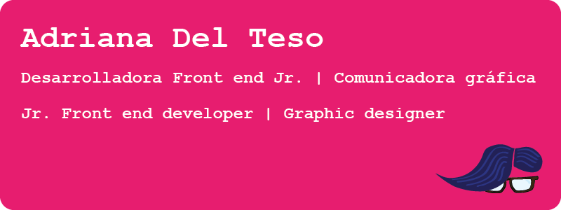

# `console.log('Hi! 👋')`

## `<banner>`

  

## `</banner>`

## `let aboutMe = [ `

Exploradora de lo terrenal y lo conocido, apasionada de la **comunicación** y sus infinitos canales, he conseguido grandes logros como la creación de productos editoriales desde cero, que ponen de relieve mi meticulosidad, ojo clínico para los detalles, así como gestión de los tiempos.

En el ámbito profesional me gusta regarlo todo de **humor** **y** **aprendizaje**
**continuo**, además de saber trazar la línea en el mapa que separa lo profesional de lo personal.

Ahora me embarco hacia el nuevo mundo del **desarrollo front-end**, para
navegar por los canales del cero y el uno que valen mucho más que eso, y están cargados de futuro.

¡No le tengo miedo a las documentaciones farragosas de un nuevo _framework_ o tecnología!

## `];`

## `let techStack = [ `

### `{Front_end:`

### `},`

### `{Back_end:`

### `},`

### `{Diseño:`

### `},`

### `{Herramientas:`

### `},`

### `{Trabajo_remoto:`

### `}`

## `];`

## 💬 **`let contact =`**

## `;`

## ⚡️ **`let projects = [`**

## `];`

## 📈 **`let statics =`**

## `;`

<!--
**2y2son4/2y2son4** is a ✨ _special_ ✨ repository because its `README.md` (this file) appears on your GitHub profile.

Here are some ideas to get you started:

- 🔭 I’m currently working on ...
- 🌱 I’m currently learning ...
- 👯 I’m looking to collaborate on ...
- 🤔 I’m looking for help with ...
- 💬 Ask me about ...
- 📫 How to reach me: ...
- 😄 Pronouns: ...
- ⚡ Fun fact: ...
-->
